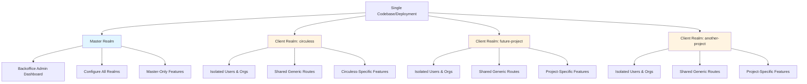
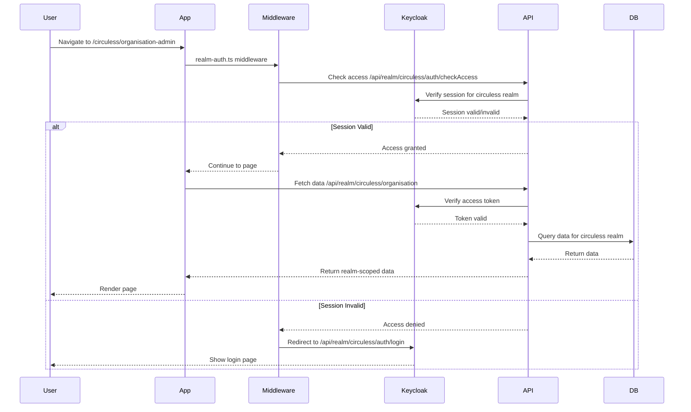
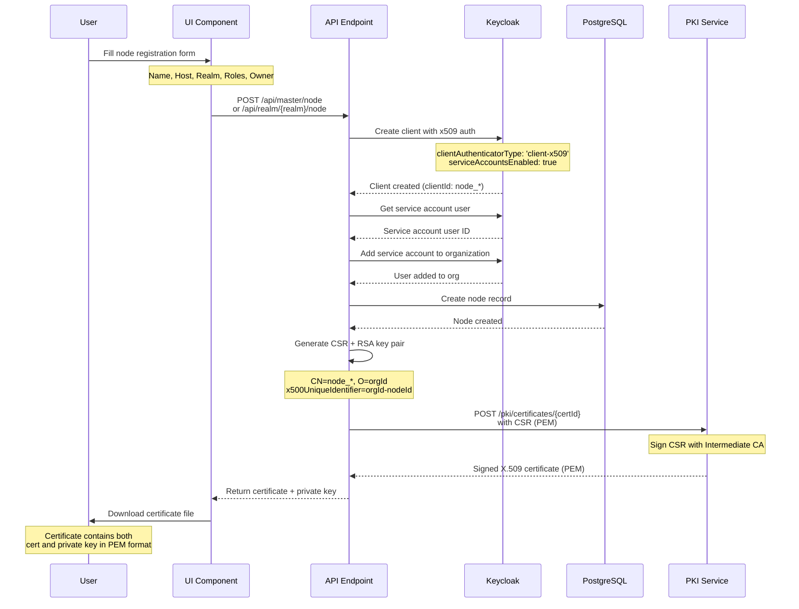
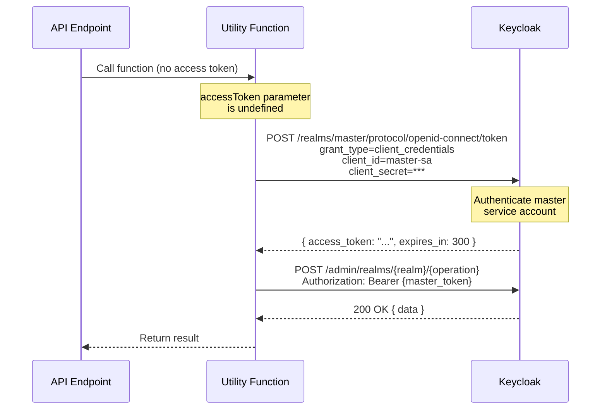

# Circuless Management UI

Circuless Management UI is a Nuxt 3 application. It provides a comprehensive platform for managing the Circuless ecosystem, enabling users to register nodes, manage partnerships, and handle organization data.

## Dependencies
- PrimeVue
- TailwindCSS
- Pinia
- Prisma
- Postgresql
- Joi
- Keycloak

## Getting Started

This is a Nuxt 3 application with TypeScript support. Follow the standard process:

1. Install dependencies:
    ```bash
    npm install
    ```

2. Provide the necessary configuration in your environment variables and database setup.

3. Start the development server:
    ```bash
    npm run dev
    ```

> **Note:** Make sure to configure your database connection and environment variables before starting the application.

## Database Setup

The application uses Prisma ORM with PostgreSQL. Run database migrations:

```bash
npx prisma migrate dev
```

Seed the database (optional):
```bash
npx prisma db seed
```

## OpenAPI Schema Generation

Generate OpenAPI schemas from Joi validation schemas:

```bash
npm run generate:schemas
```

This creates copy-pasteable schemas in `src/server/schemas/generated.txt`. Copy the schema objects into `defineRouteMeta` for OpenAPI documentation.

**Example:**
```typescript
defineRouteMeta({
  openAPI: {
    requestBody: {
      content: {
        'application/json': {
          schema: { /* paste generated schema here */ }
        }
      }
    }
  }
})
```

**Note:** Due to Nitro macro limitations, schemas must be manually copied - dynamic variables don't work in `defineRouteMeta`. GitHub issue: https://github.com/nitrojs/nitro/issues/2974

## Deploy

Build the application for production and deploy using Docker:

```bash
./buildAndPublish.sh
```

Or use Docker Compose for local deployment:

```bash
docker-compose up -d
```

> **Note:** Application container will be restarted automatically.

## Available Scripts

- `npm run dev` - Start development server
- `npm run build` - Build for production with type checking
- `npm run generate` - Generate static site
- `npm run preview` - Preview production build locally
- `npm run typecheck` - Run TypeScript type checking
- `npm run generate:schemas` - Generate OpenAPI schemas from Joi
- `npm run generate:openapi` - Generate OpenAPI documentation

## Project Structure

- `/src/api/` - API routes organized by realm (circuless, master, realm-specific)
- `/src/components/` - Vue components organized by feature
- `/src/pages/` - File-based routing pages
- `/src/server/` - Nitro server-side functionality
- `/prisma/` - Database schema and migrations
- `/lib/` - Shared utilities and configurations

## Project Architecture

### Multi-Realm Architecture

This application is architected to serve multiple isolated client projects from a single codebase using Keycloak realms. This eliminates the need to fork, clone, or maintain separate codebases for each new project.

#### Realm Types

The application supports two types of realms:

1. **Master Realm** (`master`) - A hardcoded administrative realm providing a CMS-like backoffice dashboard. Admins can configure all aspects of client realms plus additional master-only features.

2. **Client Realms** (e.g., `circuless`) - Each client project gets its own isolated Keycloak realm with complete separation of users, organizations, nodes, and data. New clients can be added by simply updating configuration - no code changes required.

#### Architecture Diagram



#### Request Flow



### Folder Structure Conventions

The codebase follows strict conventions to separate shared (generic) code from realm-specific implementations:

#### API Routes (`src/server/api/`)

- **`/master/`** - Master realm-specific endpoints (e.g., `/api/master/auth/login`)
- **`/realm/[realm]/`** - Dynamic endpoints shared across all client realms (e.g., `/api/realm/circuless/user`)
- **`/circuless/`** - Circuless-specific endpoints not applicable to other clients (e.g., `/api/circuless/marketplace`)
- **`/node/`** - Global endpoints not tied to any specific realm

**Rule**: If functionality should be available to all client realms, use `/realm/[realm]/`. If it's specific to one client project, create a dedicated folder.

#### Components (`src/components/`)

- **`/realm/`** - Generic components reusable across all client realms
  - Example: `realm/header/`, `realm/partnership/`, `realm/user/`
- **`/master/`** - Master realm-specific components
- **`/circuless/`** - Circuless-specific components

**Rule**: Components in `/realm/` must not contain hardcoded client-specific logic. Use props and dynamic realm parameters instead.

#### Pages (`src/pages/`)

- **`/master.vue` + `/master/`** - Master realm entry point and pages
- **`/[realm]/`** - Dynamic pages shared across all client realms (e.g., `/[realm]/organisation-admin.vue`)
- **`/circuless.vue` + `/circuless/`** - Circuless entry point and specific pages

**Rule**: Each new client realm requires at minimum its own entry point page (e.g., `/mynewrealm.vue`) but can reuse all `/[realm]/` dynamic pages.

#### Middleware (`src/middleware/`)

- **`master-auth.ts`** - Authentication middleware for master realm
- **`realm-auth.ts`** - Generic authentication middleware for any client realm (extracts realm from route params)
- **`circuless-auth.ts`** - Circuless-specific authentication middleware (hardcoded to circuless realm)

### Authentication & Session Management

Each realm has completely isolated authentication using Keycloak:

#### Middleware Pattern

Pages use `definePageMeta` to specify which middleware to apply:

```typescript
// Master realm page
definePageMeta({
  middleware: ['master-auth'],
})

// Dynamic realm page (extracts realm from route params)
definePageMeta({
  middleware: ['realm-auth'],
})

// Circuless-specific page
definePageMeta({
  middleware: ['circuless-auth'],
})
```

The middleware checks access via API calls to `/api/[realm]/auth/checkAccess` and redirects to login if needed.

#### Session Storage

Sessions are stored with realm-prefixed cookies (e.g., `circuless_session_id`, `master_session_id`) to enable:
- Isolated authentication per realm
- Separate token management for each realm
- Independent session lifecycles

**Note**: The current implementation uses an in-memory `SessionStore` suitable for development. For production with horizontal scaling, consider using Redis or another distributed session store.

#### Authentication Flow

1. User navigates to a protected page (e.g., `/circuless/organisation-admin`)
2. Middleware (`realm-auth.ts`) checks for active session via `/api/realm/circuless/auth/checkAccess`
3. If no session exists, user is redirected to `/api/realm/circuless/auth/login`
4. Keycloak handles authentication and redirects to `/api/realm/circuless/auth/loginCallback`
5. Server exchanges auth code for tokens and creates session with realm-prefixed cookie
6. User is redirected back to original page
7. Subsequent requests include session cookie for token verification

### Adding a New Client Realm

Adding a new client project requires only configuration changes - no code forking:

#### Step 1: Update Prisma Realm Enum

Add the new realm to `prisma/models/misc.prisma`:

```prisma
enum Realm {
  master
  circuless
  mynewproject  // Add your new realm here
}
```

#### Step 2: Run Database Migration

```bash
npx prisma migrate dev --name add_mynewproject_realm
```

#### Step 3: Configure Keycloak

In your Keycloak instance:

1. Create a new realm named `mynewproject`
2. Create a client in that realm with:
   - Client ID: `mynewproject`
   - Client authentication: ON
   - Valid redirect URIs: `${NUXT_PUBLIC_APP_URL}/api/realm/mynewproject/auth/loginCallback`
   - Generate and save the client secret

#### Step 4: Update Environment Variables

Update your `.env` file with the new realm configuration:

```bash
# Add to NUXT_PUBLIC_OIDC_REALMS (publicly visible configuration)
NUXT_PUBLIC_OIDC_REALMS='{
   "master":{
      "client_id":"admin",
      "realm":"master"
   },
   "circuless":{
      "client_id":"circuless",
      "realm":"circuless"
   },
   "mynewproject":{
      "client_id":"mynewproject",
      "realm":"mynewproject"
   }
}'

# Add to NUXT_OIDC_REALM_SECRETS (server-side only, keep secret!)
NUXT_OIDC_REALM_SECRETS='{
   "master":"master-client-secret",
   "circuless":"circuless-client-secret",
   "mynewproject":"mynewproject-client-secret"
}'
```

**Security Note**: Never commit real client secrets to version control. Use `.env` files locally and secure environment variable management in production.

#### Step 5: Create Entry Point Page

Create a new entry point at `src/pages/mynewproject.vue`:

```vue
<template>
  <div class="w-full h-full lg:flex lg:flex-col">
    <MyNewProjectHeader :my="my" :loading="loading" class="fixed lg:inherit top-0 left-0 w-full z-50" />
    <div class="w-full lg:grow bg-whitesmoke bg-opacity-20 pt-14 lg:overflow-y-auto">
      <NuxtPage />
    </div>
  </div>
</template>

<script setup lang="ts">
import { Realm } from '@prisma/client'
import { useRealmUserStore } from '~/stores/realm/user'

definePageMeta({
  middleware: ['mynewproject-auth'],
})

const realmUserStore = useRealmUserStore()
const { my, loading } = storeToRefs(realmUserStore)

await callOnce(async () => {
  await realmUserStore.getMy(Realm.mynewproject)
})
</script>
```

#### Step 6: Add Realm Link to Home Page (Optional)

Update `src/pages/index.vue` to include a link to your new realm:

```vue
<NuxtLink to="/mynewproject" class="w-full">
  <Button class="w-full">My New Project</Button>
</NuxtLink>
```

#### Step 7: Restart Application

```bash
npm run dev
```

Your new client realm is now fully functional with access to all shared routes and components!

### Routing Patterns

The application uses Nuxt's dynamic routing to maximize code reuse:

#### Dynamic API Routes

Example: `src/server/api/realm/[realm]/auth/login.get.ts`

```typescript
export default defineEventHandler(async (event) => {
    return await apiWrapper(
        event,
        async ({ params, query }) => {
            const realm = params!.realm as miscTypes.RealmTypes // Extract realm from URL
            const redirectUri = query?.redirectUri as string | undefined
            const authRedirectUrl = await keycloak.getRedirectUrl(
                event,
                realm,
                false,
                redirectUri
            )
            await sendRedirect(event, authRedirectUrl.toString())
        },
        {
            schemas: {
                params: miscTypes.ClientRealmsParamSchema,
                query: authTypes.AuthQuerySchema,
            },
            protected: false,
        }
    )
})
```

This single file handles login for all client realms: `/api/realm/circuless/auth/login`, `/api/realm/mynewproject/auth/login`, etc.

#### Dynamic Pages

Example: `src/pages/[realm]/organisation-admin.vue`

```typescript
definePageMeta({
  middleware: ['realm-auth'], // Automatically validates based on realm in URL
})

const route = useRoute()
const realm = ref(route.params.realm as Realm) // Extract realm from route params

await callOnce(async () => {
  await realmUserStore.getMy(realm.value) // Use realm dynamically
})
```

This allows URLs like `/circuless/organisation-admin`, `/mynewproject/organisation-admin` to use the same page component.

#### Client-Specific Routes

When functionality is specific to one client, create dedicated routes:

- **Static page**: `src/pages/circuless/marketplace/index.vue` → `/circuless/marketplace`
- **Static API**: `src/server/api/circuless/marketplace/index.get.ts` → `/api/circuless/marketplace`

These won't be accessible to other client realms.

### Benefits of This Architecture

1. **Zero Code Duplication** - One codebase serves unlimited client projects
2. **Easy Maintenance** - Bug fixes and features automatically available to all clients
3. **Fast Onboarding** - New client projects ready in minutes via configuration
4. **Complete Isolation** - Each client has separate users, data, and Keycloak realm
5. **Flexible Customization** - Client-specific features can be added without affecting others
6. **Type Safety** - Prisma enum ensures compile-time validation of realm values

---

## Advanced Features

This section documents complex, non-obvious features that require special explanation for developers working with this codebase. These features implement sophisticated patterns and integrations that go beyond standard CRUD operations.

### Node Registration with mTLS Authentication

The node registration system enables platform nodes (external services) to authenticate with Keycloak using X.509 client certificates instead of shared secrets, providing strong cryptographic identity verification.

#### What It Does

When you register a node, the system:
1. Creates a Keycloak client configured for certificate-based authentication
2. Generates an RSA key pair and certificate signing request (CSR)
3. Signs the certificate using an external PKI service
4. Returns a certificate file for deployment on the node
5. The node can then use this certificate to obtain access tokens from Keycloak

**Why this matters:** No shared secrets to manage or rotate. Nodes authenticate using cryptographic certificates that can be easily revoked if compromised.

#### Registration Flow



#### How to Register a Node

**API Endpoints:**
- Master realm: `POST /api/master/node`
- Client realm: `POST /api/realm/{realm}/node`

**Request body:**
```json
{
  "name": "bAvenir",
  "host": "bavenir.eu",
  "realm": "circuless",
  "roles": ["platform", "consumer"],
  "access": "direct",
  "ownerId": "org-id-123"
}
```

**Response includes:**
- Node database record
- X.509 certificate (PEM format)
- Private key (PEM format)
- Keycloak client details

**⚠️ Important:** Download and securely store the certificate file immediately. The private key is only transmitted once and never stored in the database.

**What happens behind the scenes:**

1. **Keycloak client created** with `clientAuthenticatorType: 'client-x509'` and service account enabled
2. **Service account user** created and added to the organization
3. **RSA 2048-bit key pair** generated using `node-forge`
4. **CSR signed** by external PKI service (`NUXT_PKI_URL`)
5. **Certificate and private key** returned for download

**Implementation files:**
- Business logic: `src/server/utils/nodeManager.ts`
- PKI integration: `src/server/utils/pki.ts`
- API endpoints: `src/server/api/master/node/`, `src/server/api/realm/[realm]/node/`

#### Configuration Requirements

**Environment Variables:**

```bash
# PKI Service
NUXT_PKI_URL='https://pki.circuless.bavenir.eu'
NUXT_PKI_USER='cc'
NUXT_PKI_PASSWORD='your-password'

# Keycloak
NUXT_KEYCLOAK_URL='https://auth.dev.circuless.bavenir.eu'
NUXT_KEYCLOAK_MASTER_CLIENT_ID='master-sa'
NUXT_KEYCLOAK_MASTER_CLIENT_SECRET='your-secret'
```

**Keycloak Setup:**

1. Import Root CA certificate into realm truststore
2. Configure realm to enable X.509 authentication
3. Ensure master realm has service account with admin roles

**Certificate Requirements:**
- RSA 2048-bit keys
- CN must match `node_{name}` pattern
- Validity period: typically 1 year
- Must be signed by trusted Intermediate CA

#### Troubleshooting

**Issue: "invalid_client" error during token acquisition**
- **Cause:** Certificate CN doesn't match client's `x509.subjectdn` pattern
- **Solution:** Verify certificate CN with `openssl x509 -in cert.pem -noout -subject`

**Issue: "Certificate validation failed"**
- **Cause:** Root CA not in Keycloak truststore or certificate expired
- **Solution:** Check certificate expiration with `openssl x509 -in cert.pem -noout -dates` and verify truststore contains Root CA

**Issue: "Failed to sign certificate request"**
- **Cause:** PKI service unreachable or invalid credentials
- **Solution:** Verify `NUXT_PKI_URL` and test credentials with curl

**Issue: Node token verification fails (401)**
- **Cause:** Token expired or public key mismatch
- **Solution:** Tokens expire in 5 minutes by default. Refresh token before expiration. Restart server if public keys were recently rotated.

### 2. Master Token Pattern

**What It Does:**

Enables server-side operations to access Keycloak Admin API when user tokens lack sufficient permissions. Used for administrative tasks like creating users, updating organizations, and managing realm resources.

**Why It's Needed:**

Client realm users (e.g., `circuless` realm) don't have admin API access by default. Only the master realm service account has the necessary roles. This pattern acquires a master realm token when needed.

#### How to Use Master Tokens

All utility functions support an optional `accessToken` parameter. When omitted, the function automatically acquires a master token:

```typescript
// Automatic master token acquisition
await keycloak.inviteUserToOrganisation(
  event,
  email,
  organisationId,
  realm
  // No token parameter - uses master token internally
)

// Explicit user token (if user has permissions)
await keycloak.updateOrganisation(
  event,
  organisationId,
  { alias: 'new-alias' },
  realm,
  userAccessToken  // Use user's token instead
)
```

**When master tokens are used:**
- User invitations (`userManager.ts` - inviteUserToOrganisation)
- Organization updates (`organisationManager.ts` - update, delete)
- User management (create, update, delete, role assignments)
- Realm resource management

**Implementation files:**
- Master token acquisition: `src/server/utils/keycloak.ts` (getMasterToken method)
- User operations: `src/server/utils/userManager.ts`
- Organization operations: `src/server/utils/organisationManager.ts`

#### Master Token Flow



#### Security Considerations

**Master tokens have elevated privileges:**
- Can perform any admin operation across all realms
- Should only be used server-side, never exposed to clients
- Short-lived (5 minutes) and not cached between requests

**Best practices:**
- Use user tokens when available (pass `accessToken` parameter)
- Only fall back to master tokens for operations requiring admin roles
- Never log master tokens or responses containing sensitive data
- Rotate `NUXT_KEYCLOAK_MASTER_CLIENT_SECRET` regularly

#### Pattern Comparison

| Aspect | User Token | Master Token |
|--------|------------|--------------|
| **Scope** | Single realm, user-specific | All realms, service account |
| **Permissions** | User's assigned roles | Full admin access |
| **Use Case** | User-initiated actions | Background/admin tasks |
| **Acquisition** | From user session | OAuth client credentials |
| **Caching** | Session cookie | Not cached (acquired per request) |
| **Security Risk** | Low (user permissions) | High (full admin access) |

---

## 🧪 Testing

```bash
# Run all tests
npm run test

# Run tests in watch mode
npm run test:watch
```

## 📦 Deployment

### Docker Deployment

```bash
# Build Docker image
docker build -t circuless-ui .

# Run container
docker run -p 3000:3000 circuless-ui
```

### Production Build

```bash
# Build for production
npm run build

# Start production server
npm run start
```

---

## 📄 License

This project is licensed under the Apache License 2.0 - see the [LICENSE.txt](LICENSE.txt) file for details.
